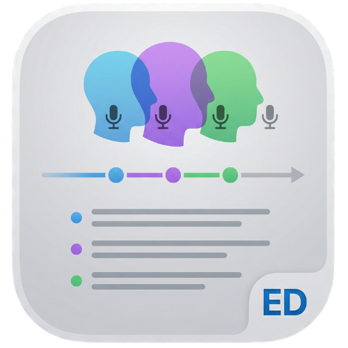

<p align="center">
  
</p>

<h1 align="center">EchoDraft</h1>

<p align="center">
  <strong>Offline-first macOS app for local transcription, summaries, and chat over your recordings — powered by on-device MLX, with no cloud inference in the core workflow.</strong>
</p>

<p align="center">
  Built for podcasters, researchers, students, and anyone who wants transcripts and notes to stay on their Mac.
</p>

<p align="center">
  <a href="#download">Download</a> · <a href="#features">Features</a> · <a href="#how-it-works">How it works</a> · <a href="#building-from-source">Build</a> · <a href="#configuration">Configuration</a> · <a href="#data--privacy">Privacy</a>
</p>

---

## What is EchoDraft?

EchoDraft is an **open-source, native Swift/SwiftUI** app for **macOS 15+**. It ingests audio and video files, **extracts audio** when needed, runs **local speech-to-text** (MLX / Qwen3-ASR by default), applies **lightweight speaker segmentation**, and lets you **edit transcripts**, **generate summaries**, and **ask questions** over the text — all with **SwiftData** for a searchable local library.

- **Privacy-first:** Core processing runs on your machine. Model weights are downloaded **once** from Hugging Face into the standard cache, then reused **offline** (see [Data & privacy](#data--privacy)).
- **Apple Silicon friendly:** MLX inference is tuned for M-series Macs; Intel is not a primary target for distributed builds.

Product detail and roadmap notes live in [.agent/prd.md](.agent/prd.md) and [.agent/first-release-v1.md](.agent/first-release-v1.md).

## Features

### Library & review

| Capability | Description |
|------------|-------------|
| **Import** | Drag-and-drop or file picker for common audio/video formats; audio is extracted in the background for video. |
| **Queue** | Process files one at a time with visible progress; size/duration limits protect against runaway memory use. |
| **Transcript editor** | Edit text and speaker labels; library search across recordings. |
| **Playback** | Built-in player; **click a segment timestamp** to jump in the audio. |
| **Export** | Markdown copy, PDF, ZIP (transcript + audio when available). |

### AI (local)

| Area | Description |
|------|-------------|
| **Speech-to-text** | Default: **Qwen3-ASR** (mlx-audio). Override with `ECHODRAFT_STT_MODEL`. |
| **Summaries** | Template styles (e.g. bullets, executive) via a small local **LLM** (default: Phi-3.5-class). |
| **Chat** | Ask questions grounded in the current transcript. |
| **Stub mode** | `ECHODRAFT_USE_STUB_ML=1` for UI/dev without loading MLX (CI-friendly). |

### Distribution & tooling

| Topic | Notes |
|-------|--------|
| **GitHub Releases** | Unsigned **DMG** + checksums attached by [release workflow](.github/workflows/release.yml). |
| **Homebrew** | [Cask template](packaging/homebrew/Casks/echodraft.rb) for your own tap — see [packaging/homebrew/README.md](packaging/homebrew/README.md). |
| **Sparkle** | Planned after signed releases; see [packaging/SPARKLE.md](packaging/SPARKLE.md). |

## Who it’s for

| Use case | How EchoDraft helps |
|----------|---------------------|
| **Podcasters & interviewers** | Transcribe recordings, skim by timestamp, export for show notes. |
| **Researchers & students** | Keep transcripts local, search the library, summarize long sessions. |
| **Developers** | Inspect the SwiftUI + MLX + SwiftData stack; run in stub mode without GPUs. |

## How it works

1. **Add media** — Use **Add files** or drag files into the app (with sandbox permissions as required).
2. **Process** — The app extracts audio if needed, transcribes with MLX, and stores segments in **SwiftData**.
3. **Review** — Play audio, edit transcript lines, use **Summary** / **Chat** when you need condensed text or Q&A.
4. **Export** — Copy Markdown, save PDF, or ZIP transcript + audio.

## Download

**[Download the latest DMG from GitHub Releases](https://github.com/turhancan97/EchoDraft/releases/latest)** (when published).

Or install from a **Homebrew tap** you maintain (after publishing the cask):

```bash
# Example — replace with your published tap name:
brew tap YOUR_GITHUB_USER/homebrew-tap
brew install --cask echodraft
```

See [packaging/homebrew/README.md](packaging/homebrew/README.md) for updating `version`, `sha256`, and `url` after each release.

### Requirements (runtime)

- **macOS 15** (Sequoia) or later  
- **Apple Silicon** recommended for MLX  
- First-time ML use may **download large model checkpoints**; then works offline from cache.

### First launch (notarized / outside Mac App Store)

If macOS blocks the app because it was downloaded from the internet, you can clear quarantine once (adjust the path if you moved the app):

```bash
xattr -cr /Applications/EchoDraft.app
```

Then **right-click → Open** the first time. Prefer **signed & notarized** builds for public distribution; see [packaging/README.md](packaging/README.md) and [packaging/DISTRIBUTION.md](packaging/DISTRIBUTION.md).

---

## Building from source

### Requirements

- **macOS 15+**
- **Xcode 16+** (full Xcode app; Command Line Tools alone are not enough for SwiftData macros)
- **[XcodeGen](https://github.com/yonaskolb/XcodeGen)** — only if you edit [`project.yml`](project.yml)

### Clone & run (recommended)

```bash
git clone https://github.com/turhancan97/EchoDraft.git
cd EchoDraft
open EchoDraft.xcodeproj
```

1. Select the **EchoDraft** scheme and **My Mac**.  
2. **Run** (⌘R).

**Important:** Open **`EchoDraft.xcodeproj`**, not `Package.swift` as the primary project. The Swift package exposes **`EchoDraftCore`** only; the **`.app`** bundle is built by the Xcode **application** target.

Regenerate the Xcode project after changing `project.yml`:

```bash
xcodegen generate
```

### Command-line build (CI-style)

```bash
xcodebuild -project EchoDraft.xcodeproj -scheme EchoDraft \
  -destination 'platform=macOS' \
  -configuration Debug \
  CODE_SIGNING_ALLOWED=NO \
  build
```

`swift build` compiles the **library** target only; the macOS app is built via **Xcode** / `xcodebuild` as above.

### Project layout

```text
EchoDraft/
├── Package.swift                 # Swift Package: EchoDraftCore library only
├── EchoDraft.xcodeproj/          # Generated by XcodeGen (committed for CI & archives)
├── project.yml                   # XcodeGen spec
├── Sources/
│   ├── EchoDraftCore/            # Models (SwiftData), services, view models, SwiftUI views
│   └── EchoDraftApp/             # @main app, Info.plist, Assets, menu bar extra
├── assets/                       # Source art for icons (see AppIcon in app target)
├── packaging/                  # DMG script, Homebrew cask template, Sparkle notes
├── .github/workflows/            # CI, release automation
└── .agent/                       # PRD & release checklist (for contributors)
```

### CI

[`.github/workflows/ci.yml`](.github/workflows/ci.yml) runs `xcodebuild` on **macOS 15**, **Debug**, `CODE_SIGNING_ALLOWED=NO`, on pushes/PRs to `main` / `master`.

---

## Configuration

Environment variables (optional):

| Variable | Effect |
|----------|--------|
| `ECHODRAFT_USE_STUB_ML=1` | Stub STT + LLM (fast UI/dev; no MLX). |
| `ECHODRAFT_STT_MODEL` | Hugging Face repo id for Qwen3-ASR (default `mlx-community/Qwen3-ASR-0.6B-4bit`). |
| `ECHODRAFT_STT_CHUNK_DURATION_SEC` | Max chunk length in seconds for long audio (default 1200). **Lower** (e.g. `180`–`300`) **reduces peak RAM**. |
| `ECHODRAFT_STT_MIN_CHUNK_DURATION_SEC` | Minimum chunk seconds (default `1`). |
| `ECHODRAFT_STT_MAX_TOKENS` | Decoder cap (default 8192). |
| `ECHODRAFT_STT_LANGUAGE` | e.g. `English` — quality hint. |
| `ECHODRAFT_LLM_MODEL` | Override LLM id (default Phi-3.5-class instruct). |
| `HF_TOKEN` | Optional; for private Hugging Face models. |

Set in **Xcode → Scheme → Run → Arguments → Environment Variables**, or export in your shell before launching from Terminal.

---

## Data & privacy

- **Library:** SwiftData store (system-managed location). Legacy `library.json` may be **migrated once** into SwiftData and renamed (see app migration logic).  
- **Models:** STT/LLM weights download from **Hugging Face** on **first use** per model, then load from the **hub cache** offline.  
- **No cloud API** in EchoDraft’s own code for transcription/LLM — third-party MLX stacks perform hub/cache access as documented upstream.

---

## Releases

1. Bump **`MARKETING_VERSION`** / **`CURRENT_PROJECT_VERSION`** in [`project.yml`](project.yml), run `xcodegen generate`, commit.  
2. Tag: `git tag v1.0.0 && git push origin v1.0.0`.  
3. [`.github/workflows/release.yml`](.github/workflows/release.yml) builds **Release**, runs [`packaging/scripts/make-dmg.sh`](packaging/scripts/make-dmg.sh), uploads the versioned DMG (e.g. `EchoDraft-1.0.0.dmg`) and `checksums.txt`.

Manual **workflow_dispatch** builds are available from the Actions tab for test artifacts. Signing and notarization for wide distribution are documented under [packaging/](packaging/).

---

## Contributing

Issues and pull requests are welcome. For architecture and product scope, see [.agent/prd.md](.agent/prd.md) and [.agent/agent.md](.agent/agent.md). Heavy MLX tests are intentionally not run in default CI; run integration checks locally with models cached.

---

## License

Add a `LICENSE` file at the repository root to state terms (e.g. MIT, Apache-2.0). Until then, assume **all rights reserved** unless you publish a license.
